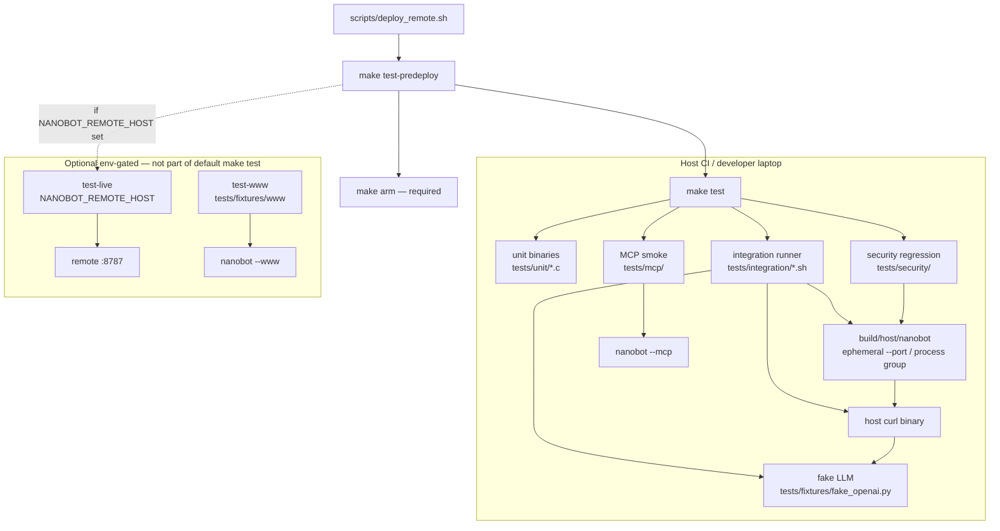

# Testing Framework Design — nanobot

> **Scope note:** This design is **host-first**. Optional “live remote” probes
> use generic env (`NANOBOT_REMOTE_HOST` for optional live remote).
> Optional `--www DIR` serves operator-supplied static files only.

# nanobot Testing Framework Design

| Field | Value |
|-------|-------|
| **Document** | Testing Framework Design |
| **Product** | nanobot (binary `nanobot`) |
| **Author** | TBD |
| **Date** | 2026-07-20 |
| **Status** | Draft (revised post-review) |
| **Related** | `docs/SECURITY_AUDIT.md`, `SECURITY.md`, `Makefile`, `docs/PEER_BUS.md`, `docs/LIMITS.md` |

---

## Overview

nanobot is a ~4kLOC pure-C agent host (CLI, HTTP peer bus on `:8787`, optional MCP stdio, optional `--www` static files) usable on low-RAM hosts. Today the only automated checks are `make test` (`--version` / `--help`) and a one-shot `make test-mcp` handshake. Recent security work (`require_peer_auth`, `static_path_ok`, `ct_eq`, shell denylist expansion, digits-only job IDs) has no regression harness, so patches can re-break silently before remote deploy.

This design proposes a **practical, incremental testing framework** that matches the project ethos: no heavy C test frameworks, host-first CI, tmp-isolated `NANOBOT_HOME`, optional live remote gates, and a hard pre-deploy smoke path. Coverage is layered:

1. **Unit** — pure helpers in `util.c` / `shell.c` (+ small extracted security helpers).
2. **Integration** — real host binary, ephemeral port, curl/Python against peer + API.
3. **MCP smoke** — Content-Length and NDJSON initialize / tools/list / tools/call.
4. **Security regression** — automated encodings of `docs/SECURITY_AUDIT.md` findings.
5. **Live (optional)** — remote host when `NANOBOT_REMOTE_HOST` is set.
6. **optional static smoke (optional)** — lightweight static + reverse-proxy checks.

**Normative harness rules** (must hold for all host integration/security tests):

- Unset `NANOBOT_PEER_TOKEN` and `NANOBOT_PEER_TOKEN` (file token only).
- All client URLs use `http://127.0.0.1:$PORT` (never `localhost` / `::1`).
- Server started in its own process group; teardown kills the group after job workers finish.
- Host deps for the full default suite: `gcc`, `python3`, **`curl`** (system binary; agent uses `execvp("curl", …)`).

---

## Background & Motivation

### Current state

| Path | Role today |
|------|------------|
| `Makefile` `test` | `build/host/nanobot --version` and `--help` |
| `Makefile` `test-mcp` | Single `initialize` over Content-Length framing into `--mcp` |
| `docs/SECURITY_AUDIT.md` | Manual curl verification checklist only |
| `docs/PEER_BUS.md` | Still says “Optional peer token” — **stale** vs post-audit fail-closed (`SECURITY.md`) |
| `scripts/deploy_remote.sh` | Deploy + ad-hoc on-target `curl` health/info; no preflight suite |
| No `tests/` tree | — |
| No CI config (`.github/`, etc.) | — |

Source layout (host + armv7 musl static, single-binary link of all `src/*.c`):

```
nanobot/
  src/{util,shell,auth,memory,agent,http,mcp,improve,main}.c
  scripts/{deploy_remote,peer_mcp_bridge,run}.sh|.py
  docs/SECURITY_AUDIT.md
fixture: tests/fixtures/www + serve.py
```

### Pain points

1. **Security patches are unverified in CI.** C1 (unauth peer RCE), H1 (path traversal), H2 (job path confusion), M1 (token compare), M2 (denylist) only have human curl steps.
2. **Helpers are hard to unit-test as written.** `ct_eq`, `static_path_ok`, `require_peer_auth`, `peer_token_expected` are `static` inside `src/http.c` (~973 lines). Public APIs suitable for unit tests today: `ng_command_denied`, `ng_json_*`, `ng_slurp_env_file`, `ng_settings_*`, `ng_json_escape`, limits helpers.
3. **Agent/LLM coupling.** Peer `POST /peer/v1/prompt` and MCP `nanobot_ask` need a backend. Cloud Grok is unsuitable for CI; offline OpenAI-compatible path (`--offline` / `--base-url`) is the right seam for a fake LLM. That path uses **system `curl`** via `curl_post_json()` in `src/agent.c` (~96–168).
4. **Lean-host constraints.** ~256MB-class targets, lean mode (`NG_LEAN_*` in `src/util.h`), deploy may restart process — live tests must be sparse, short, and env-gated.
5. **Contributing contract.** `CONTRIBUTING.md`: “Small, readable C; no heavy frameworks” and `make host && make test` before handoff — any framework must extend that, not replace it with CMake/Check/Unity ecosystem.
6. **Token resolution has three sources.** `peer_token_expected()` (`http.c` 79–104): file `$NANOBOT_HOME/peer_token` (`token=` or raw line), then env `NANOBOT_PEER_TOKEN` / `NANOBOT_PEER_TOKEN`. Isolation must neutralize env or C2/auth tests lie.

### Constraints (non-negotiable)

- CI must pass **on host without device**.
- Prefer **host gcc**; armv7 binary may be `file`-checked only in default suite.
- **No secrets in git** (peer tokens, session files already gitignored).
- Tests must not leave processes on fixed port `8787` (use ephemeral ports).
- Live remote host tests only when `NANOBOT_REMOTE_HOST` is set and SSH works.
- Do not claim affiliation with Grok / OEM (existing LEGAL posture).
- Host integration/security suites **unset peer-token env vars** and use **only** synthetic file tokens under tmp home.
- Client base URL is always **`http://127.0.0.1`** (IPv4); never bare `localhost`.

### Host dependencies (default suite)

| Tool | Why |
|------|-----|
| `gcc` | Build host binary + unit tests |
| `make`, coreutils, bash | Build + shell harness |
| `python3` | MCP smoke, fake OpenAI server, ephemeral port helper |
| **`curl`** | (1) Integration client probes; (2) **required by product code** — `ng_agent_run` → `curl_post_json` → `execvp("curl", …)` for offline/chat completions. Without host `curl`, fake LLM is up but prompt tests always fail. |

Preflight: integration runner checks `command -v curl` and `command -v python3` before L2/L3/L4 offline cases; fail with a clear message (not a cryptic agent “curl failed” string). Unit-only (`make test-unit` / `TEST_QUICK` without offline) does not require a live HTTP agent path but still benefits from `curl` for peer HTTP matrix once integration is in the default gate.

---

## Goals & Non-Goals

### Goals

1. Catch regressions in pure helpers and security controls **before** deploy.
2. Exercise real peer HTTP auth matrix (401 / 503 / 200) and MCP framing.
3. Provide `make test` as the single default gate used by CONTRIBUTING (composition hardens only in a dedicated PR — see Rollout / PR Plan).
4. Support offline agent path via a **fake OpenAI-compatible** HTTP backend whose JSON matches `ng_json_message_content` / `ng_json_first_tool_call`.
5. Isolate all state under mktemp `NANOBOT_HOME` (never `~/.nanobot` or real install paths in host tests); neutralize env token fallbacks.
6. Gate live remote without failing default CI when absent; optional www-fixture smoke uses in-tree fixture only.
7. Document a **pre-deploy** sequence that deploy scripts invoke by default (`SKIP_PREDEPLOY=1` escape).

### Non-Goals

- Full sandbox / property-based fuzzing of the shell denylist (residual risk remains documented).
- Browser E2E (Playwright/Selenium) — out of scope; HTML GET smoke on optional --www only.
- Measuring token-compare timing side channels in CI (M1 is structural unit test only).
- Cross-compiling and running unit tests under qemu-arm by default.
- Mocking every MCP tool (`remote_control`, `remote_place_go` SSH) on host CI.
- Replacing manual security reviews or the audit doc.
- Coverage tooling requirement (gcov optional later; not blocking).
- Fixing product IPv6 loopback (`client_is_loopback` is IPv4-only) in the testing PRs — residual product issue; harness avoids it.

---

## Proposed Design

### Architecture



### Layer model

| Layer | What runs | Speed target | Default CI (after PR8) |
|-------|-----------|--------------|------------------------|
| L0 CLI smoke | `--version`, `--help` | &lt;1s | Yes |
| L1 Unit | small C binaries linked with selected `src/*.c` (not full `main`) | &lt;5s | Yes |
| L2 Integration | host binary + curl/python, tmp home, ephemeral port | &lt;30s | Yes |
| L3 MCP | expand current handshake + tools/list + safe tools/call | &lt;15s | Yes |
| L4 Security | adversarial audit-ID cases (shared helpers with L2) | &lt;20s | Yes |
| L5 Live | remote health/auth against remote host | &lt;60s | No (opt-in) |
| L6 www-fixture | static index + H1 negative when tree present | &lt;10s | Soft: skip if missing; **hard-fail if present** |

**Quick iterate:** `make test-quick` = L0 + L1 + peer health/auth only (no fake LLM, no full jobs matrix, no MCP tools/call). Full `make test` remains the CONTRIBUTING handoff gate after PR8 (~1 min budget acceptable for security-focused suite).

### Suite ownership (DRY)

| Suite | Owns | Does not duplicate |
|-------|------|--------------------|
| **Integration (L2)** | Happy path + auth **split** documentation: health/info; peer shell **with** good token → 200; peer shell **without** token from 127.0.0.1 → 401; loopback `/api/*` without token allowed; jobs happy path poll to `done`; offline prompt with fake LLM | Full adversarial matrix |
| **Security (L4)** | Audit IDs: C1 extra surfaces (jobs/control no token); C2 file+env fail-closed; H1 path/`..`/charset; H2 bad job ids; M1 `ng_ct_eq` + `rg` no strcmp on tokens; M2 denylist edge cases; dual header brands; body `peer_token` auth | Re-testing `echo ok` happy shell |
| **Shared** | `tests/integration/common.sh` (`ng_test_setup` / teardown / `ng_curl`); **every** L2/L4 script sources it and traps teardown (see lifecycle) | — |

### Directory layout (new)

```
nanobot/
  tests/
    README.md                 # how to run; env vars; host deps (gcc, python3, curl)
    harness/
      nanobot_test.h          # ~80 LOC assert macros (not ThrowTheSwitch Unity)
      test_main.c             # optional shared runner entry for multi-suite
    unit/
      test_json.c
      test_shell_deny.c       # ng_command_denied (pure; no workdir init required)
      test_path.c             # ng_static_path_ok
      test_ct_eq.c            # ng_ct_eq
      test_settings.c
      test_limits.c
    integration/
      common.sh               # setup/teardown, env unset, process group, 127.0.0.1
      run_all.sh
      test_peer_health.sh
      test_peer_auth.sh       # peer always requires token; body peer_token case
      test_peer_shell.sh
      test_peer_jobs.sh
      test_api_loopback.sh
      test_offline_prompt.sh  # needs fake LLM + host curl
    mcp/
      smoke_mcp.py
    security/
      test_audit_regressions.sh
    live/
      test_remote_remote.sh
    fixtures/
      test_www_smoke.sh
    fixtures/
      fake_openai.py
      sample_chat_response.json
      sample_tool_call_response.json
      www/index.html          # mini static fixture for optional --www smoke
  build/
    host/tests/               # unit test binaries (gitignored via build/)
```

Token format is documented only in `tests/README.md` (e.g. `token=<hex>\n` under `$NANOBOT_HOME/peer_token`). **No** `peer_token.example` fixture file (avoids mountable lookalikes).

### 1. Unit / component tests (C, host gcc)

#### Harness choice

**Decision: minimal macros + one binary per suite (or one `test_all`), no external package.** Header name: `tests/harness/nanobot_test.h` (not `unity_min.h` — avoids confusion with ThrowTheSwitch Unity).

```c
/* tests/harness/nanobot_test.h — illustrative */
#ifndef NANOBOT_TEST_H
#define NANOBOT_TEST_H
#include <stdio.h>
#include <stdlib.h>
#include <string.h>

static int g_fails = 0, g_tests = 0;

#define TEST(name) static void name(void)
#define RUN(name) do { \
  g_tests++; \
  fprintf(stderr, "  RUN %s\n", #name); \
  name(); \
} while (0)

#define EXPECT_TRUE(cond) do { \
  if (!(cond)) { \
    fprintf(stderr, "FAIL %s:%d: %s\n", __FILE__, __LINE__, #cond); \
    g_fails++; \
  } \
} while (0)

#define EXPECT_STREQ(a, b) EXPECT_TRUE(strcmp((a),(b)) == 0)
#define EXPECT_EQ(a, b) EXPECT_TRUE((a) == (b))

#define TEST_REPORT() do { \
  fprintf(stderr, "tests=%d fails=%d\n", g_tests, g_fails); \
  return g_fails ? 1 : 0; \
} while (0)
#endif
```

#### What to unit-test (concrete)

| Function | File today | Cases |
|----------|------------|-------|
| `ng_command_denied` | `src/shell.c` (public, **pure** — no `ng_set_workdir` needed) | each denylist substring; length &gt;8000; backtick+rm; safe `uname -a` allowed |
| `ng_json_get_string` | `src/util.c` | simple key, missing key, escaped quotes |
| `ng_json_escape` | `src/util.c` | quotes, backslash, control chars |
| `ng_json_first_tool_call` / `ng_json_message_content` | `src/util.c` | fixtures matching agent parser (see Fake LLM) |
| `ng_slurp_env_file` | `src/util.c` | `token=…`, comments, missing |
| `ng_settings_get` / `ng_settings_set` | `src/util.c` | round-trip under tmp `ng_set_workdir` |
| `ng_resources_json` | `src/util.c` | non-NULL, expected keys |
| `ng_ct_eq` | **extract from** `http.c` | equal, length mismatch, first-byte differ |
| `ng_static_path_ok` | **extract from** `http.c` | `/index.html` ok; `/../etc/passwd` fail; no leading `/`; `%` / weird bytes fail; `~` allowed |

Note: `ng_run_command` (not just deny) needs `util.c` for limits/workdir; deny-only unit binary may link `shell.c` alone **if** it does not call `ng_run_command` — still fine to link `shell.c`+`util.c` as the default recipe.

#### Extraction for testability (production change + same-PR tests)

Security helpers currently `static` in `src/http.c` move to a thin public surface:

```c
/* src/util.h (additions) — or src/sec.h */
int ng_ct_eq(const char *a, size_t na, const char *b, size_t nb);
int ng_static_path_ok(const char *rel); /* path as seen after host, starts with / */
```

Implementations move into `util.c` (or new `src/secutil.c` added to `SRC`). `http.c` calls the public symbols. **Behavior must stay identical.**

**Mandatory verification in the extraction PR (PR2):** ship minimal unit cases for `ng_ct_eq` and `ng_static_path_ok` in the **same** PR as the move. Auth-adjacent pure helpers must not land on main with only “manual confidence.”

`require_peer_auth`, `peer_token_expected`, and `client_is_loopback` stay integration-tested only (socket + request buffer + `getpeername`).

#### Link model

Do **not** link `main.c` into unit tests.

```makefile
UNIT_SRC_COMMON := src/util.c src/shell.c

$(HOST_OUT)/tests/test_shell_deny: tests/unit/test_shell_deny.c $(UNIT_SRC_COMMON)
	@mkdir -p $(HOST_OUT)/tests
	$(HOST_CC) $(HOST_CFLAGS) -I src -I tests/harness -o $@ \
	  tests/unit/test_shell_deny.c $(UNIT_SRC_COMMON)

test-unit: host
	@set -e; for t in $(HOST_OUT)/tests/test_*; do $$t; done
```

### 2. Integration tests (HTTP peer)

#### Process lifecycle (`tests/integration/common.sh`)

**Normative script contract (every host integration and security shell script):**

Each `tests/integration/test_*.sh` and `tests/security/test_*.sh` is a **standalone entrypoint** (so `make test-quick`, `run_all.sh`, or direct `./tests/integration/test_peer_auth.sh` all behave identically). Every such script **must**:

1. `source` `tests/integration/common.sh` (resolve path relative to the script or `$ROOT`).
2. Call `ng_test_setup` (starts isolated home, unsets env tokens, optional server — or call a shared `ng_test_start_server` helper from setup).
3. `trap ng_test_teardown EXIT` **before** any assertions that might fail (so teardown always runs).
4. Use `ng_curl` (or `$NG_BASE` + explicit headers) for HTTP — never bare `localhost`.
5. Job-related scripts: wait for terminal job status **before** exiting (trap still runs teardown after).

`run_all.sh` only orchestrates by invoking these scripts (each self-contained); it must not be the sole place that sets up/tears down. MCP Python smoke manages its own tmp home + process lifecycle in-process (same isolation rules: unset env tokens, `127.0.0.1`).

Illustrative script skeleton:

```bash
#!/usr/bin/env bash
set -euo pipefail
ROOT="$(cd "$(dirname "$0")/../.." && pwd)"
# shellcheck source=tests/integration/common.sh
source "$ROOT/tests/integration/common.sh"

ng_test_setup
trap ng_test_teardown EXIT

# assertions using ng_curl / $NG_BASE / $NG_TEST_TOKEN
# Contract: ng_curl [curl-args…] <url-or-path>  — URL/path is ALWAYS last.
ng_curl -sf /peer/v1/health >/dev/null
# Auth-off cases: prefer absolute $NG_BASE URL (recommended); -o /tmp/out is a mid-arg, not the URL
NG_TEST_AUTH=0 ng_curl -sS -o /tmp/out -w "%{http_code}" \
  -X POST -H "Content-Type: application/json" \
  -d '{"command":"echo x"}' "$NG_BASE/peer/v1/shell" | grep -qx 401
# Equivalent path form (only the final arg is path-prefixed):
# NG_TEST_AUTH=0 ng_curl -sS -o /tmp/out -w "%{http_code}" -X POST \
#   -H "Content-Type: application/json" -d '{"command":"echo x"}' /peer/v1/shell
```

```bash
# common.sh — shared helpers for all integration + security host tests

ng_test_setup() {
  # 1) Neutralize env token fallbacks (peer_token_expected reads these after file)
  unset NANOBOT_PEER_TOKEN NANOBOT_PEER_TOKEN
  unset NANOBOT_PEER_URL NANOBOT_PEER_URL   # avoid accidental remote targeting

  export NANOBOT_HOME
  NANOBOT_HOME=$(mktemp -d /tmp/nanobot-test.XXXXXX)
  export NANOBOT_HOME="$NANOBOT_HOME"   # legacy alias still accepted by product
  umask 077

  # Deterministic file token only
  TOK="test-token-integration-0001"
  printf 'token=%s\n' "$TOK" > "$NANOBOT_HOME/peer_token"
  chmod 600 "$NANOBOT_HOME/peer_token"
  export NG_TEST_TOKEN="$TOK"

  PORT=$(python3 -c 'import socket;s=socket.socket();s.bind(("127.0.0.1",0));print(s.getsockname()[1]);s.close()')
  export NG_TEST_PORT="$PORT"
  # ALWAYS IPv4 loopback — client_is_loopback is AF_INET-only; never use localhost
  export NG_BASE="http://127.0.0.1:${PORT}"

  # Optional fake LLM on another ephemeral port…
  # Start nanobot in its OWN process group so job workers + HTTP children die together:
  #   setsid ./build/host/nanobot --port "$PORT" --home "$NANOBOT_HOME" ... &
  #   NB_PID=$!
  #   NB_PGID=$(ps -o pgid= -p "$NB_PID" | tr -d ' ')
  # Wait for: ng_curl -sf /peer/v1/health
}

# HTTP helper — URL-last-only contract (avoids mistaking -o /tmp/out for a path URL).
#
#   ng_curl [curl-args…] <url-or-path>
#
# - All arguments except the last are passed through to curl unchanged
#   (so -o /tmp/out, -d @/path/file, -H … work).
# - The last argument is the URL:
#     - if it begins with http:// or https:// → used as-is
#     - if it begins with / → prefixed with $NG_BASE (e.g. /peer/v1/health)
#     - otherwise → error
# - NG_TEST_AUTH=1 (default) injects -H "X-Nanobot-Peer-Token: $NG_TEST_TOKEN"
#   before the URL. Set NG_TEST_AUTH=0 for unauthenticated probes.
# Prefer absolute "$NG_BASE/…" for clarity in auth-matrix cases.
ng_curl() {
  if [[ $# -lt 1 ]]; then
    echo "ng_curl: usage: ng_curl [curl-args…] <url-or-path>" >&2
    return 2
  fi
  local auth="${NG_TEST_AUTH:-1}"
  local -a head=()
  local url="${!#}"   # last positional
  if [[ $# -gt 1 ]]; then
    head=("${@:1:$#-1}")
  fi
  case "$url" in
    http://*|https://*) ;;
    /*) url="${NG_BASE}${url}" ;;
    *)
      echo "ng_curl: last arg must be http(s) URL or absolute path under host (got: $url)" >&2
      return 2
      ;;
  esac
  local -a auth_h=()
  if [[ "$auth" == "1" && -n "${NG_TEST_TOKEN:-}" ]]; then
    auth_h=(-H "X-Nanobot-Peer-Token: ${NG_TEST_TOKEN}")
  fi
  curl -sS -m 10 "${head[@]}" "${auth_h[@]}" "$url"
}

ng_test_teardown() {
  # Job tests MUST wait for terminal job status before exiting (trap still runs this).
  if [[ -n "${NB_PGID:-}" ]]; then
    kill -TERM -- "-$NB_PGID" 2>/dev/null || true
    # wait up to ~5s for group to exit
    for _ in $(seq 1 50); do
      kill -0 -- "-$NB_PGID" 2>/dev/null || break
      sleep 0.1
    done
    kill -KILL -- "-$NB_PGID" 2>/dev/null || true
  elif [[ -n "${NB_PID:-}" ]]; then
    kill -TERM "$NB_PID" 2>/dev/null || true
    wait "$NB_PID" 2>/dev/null || true
  fi
  unset NB_PID NB_PGID
  rm -rf "${NANOBOT_HOME:-/nonexistent}"
}
```

**Why process groups:** `POST /peer/v1/jobs` forks a **worker child** (`http.c` ~737–780) in addition to the fork-per-request HTTP child (~951). Killing only the listener PID can leave workers holding files under `$NANOBOT_HOME`, race `rm -rf`, and delay port reuse. Job tests poll until `status` is `done` (or timeout fail) **before** process exit (teardown via `trap`).

**Isolation rules:**

| Variable / concern | Host tests | Live remote |
|--------------------|------------|------------|
| `NANOBOT_HOME` | always mktemp | never touch remote install home from host unit/integration |
| `NANOBOT_PEER_TOKEN` / `NANOBOT_PEER_TOKEN` | **unset** in setup | may use env or SSH-read token for optional auth probe only |
| Port | ephemeral; clients use `127.0.0.1` | `NANOBOT_REMOTE_HOST:8787` |
| Peer token file | synthetic `test-token-…` written before start | read-only if needed; never commit |
| Process tree | `setsid` + kill process group | N/A (remote) |
| Shell commands | denylist unit + safe `echo` / `uname` | optional `uname -a` only |

Server currently binds `INADDR_ANY` (`http.c` ~902). Host tests still use loopback clients + known token. **Follow-up product PR:** optional `--bind 127.0.0.1` for safer CI (Open Questions).

#### Peer / API auth matrix (normative)

Matches `require_peer_auth` in `src/http.c`:

- Peer mutating routes (`POST /peer/v1/shell|prompt|jobs|control`, `GET /peer/v1/jobs/*`): `require_peer_auth(cfd, req, /*allow_loopback=*/0)` → **token always required**, including from `127.0.0.1`.
- API mutating routes (`POST /api/chat|settings|backend|auth/start`): `allow_loopback=1` → **loopback may omit token**; non-loopback needs token.
- Missing configured token (no file, no env): **503** `peer_token not configured` / `need_peer_token` (fail closed, C2).
- Wrong/missing token when configured: **401**.

| Case | Request | Expect |
|------|---------|--------|
| Health | `GET $NG_BASE/peer/v1/health` | 200, JSON liveness |
| Info | `GET $NG_BASE/peer/v1/info` | 200, capabilities, backend kind |
| Resources | `GET $NG_BASE/peer/v1/resources` | 200 |
| **Peer shell, loopback, no token** | `POST …/shell` no header from 127.0.0.1 | **401** (critical C1 regression guard) |
| Peer shell, bad header token | wrong `X-Nanobot-Peer-Token` | 401 |
| Peer shell, good header token | correct header + `{"command":"echo nanobot-ok"}` | 200, `exit:0`, output contains `nanobot-ok` |
| Peer shell, **body** `peer_token` | no header; body `{"command":"echo ok","peer_token":"$TOK"}` | 200 (alternate auth path) |
| Peer shell, wrong body token | body token wrong, no header | 401 |
| Peer shell, legacy header | `X-Nanobot-Peer-Token` | 200 when value correct |
| Peer shell, denied cmd | `rm -rf /` with good token | 200 body, `exit` 126 / blocked (integration may smoke once; security owns edge table) |
| Jobs no token | `POST /peer/v1/jobs` | 401 |
| Jobs with token | kind shell, command echo | 202 + digit `id`; poll `GET /peer/v1/jobs/{id}` with token → `status":"done"`; **then** teardown |
| Job bad id | `GET …/jobs/../x`, `…/jobs/abc`, `…/jobs/1;id` | 400 (security owns) |
| Control POST no token | | 401 |
| API chat loopback | `POST http://127.0.0.1:$PORT/api/chat` without token | allowed when backend ready (`allow_loopback=1`) |
| C2 fail-closed | unset env; unlink `$NANOBOT_HOME/peer_token`; `POST` peer shell | **503** `need_peer_token` (security owns) |

#### Fake LLM backend (schema contract)

Product path: `ng_agent_run` → `curl_post_json` → `POST {base}/chat/completions` → parse with `ng_json_message_content` / `ng_json_first_tool_call` (`util.c` 383–406). Agent treats response bodies containing `"error"` or `"Failed to parse"` as failures (`agent.c` ~407–427).

**Simple mode (default offline prompt smoke)** — response body must be exactly this shape (or a superset that still contains `"message"` then `"content"` as a JSON string):

```json
{
  "choices": [
    {
      "message": {
        "role": "assistant",
        "content": "hello-from-fake"
      }
    }
  ]
}
```

Notes for implementers:

- Prefer `choices[0].message.content` — that is what `ng_json_message_content` looks for first (`strstr` `"message"` then `ng_json_get_string(..., "content")`).
- Fallback root `"content"` string also works but is not preferred for fixtures.
- **Do not** include the substring `"error"` anywhere in the JSON (including content text) or agent returns `API error: …`.
- `stream` is false on the request; stub may ignore request body for v1.

**Tool-call mode (optional multi-turn)** — first response includes `tool_calls`; `arguments` must be a **JSON string** (stringified object), not a nested object, because `ng_json_get_string` only extracts JSON strings and `extract_command_arg` parses that string:

```json
{
  "choices": [
    {
      "message": {
        "role": "assistant",
        "content": null,
        "tool_calls": [
          {
            "id": "call_fake_1",
            "type": "function",
            "function": {
              "name": "run_terminal_command",
              "arguments": "{\"command\":\"echo tool-ok\"}"
            }
          }
        ]
      }
    }
  ]
}
```

Second response: simple-mode final content (e.g. `"tool finished"`). Ship as `tests/fixtures/sample_chat_response.json` and `sample_tool_call_response.json`.

`tests/fixtures/fake_openai.py`:

- Listens on `127.0.0.1` ephemeral port.
- Implements `POST /v1/chat/completions` (and optional GET health).
- Default: always return simple-mode fixture.
- Env `FAKE_OPENAI_MODE=tools` enables one tool_calls then final (stateful counter).

Integration `test_offline_prompt.sh`:

```bash
# requires: command -v curl
nanobot --port "$PORT" --home "$NANOBOT_HOME" --offline \
  --base-url "http://127.0.0.1:$FAKE_PORT/v1" --model fake
curl -sS -H "X-Nanobot-Peer-Token: $NG_TEST_TOKEN" \
  -H 'Content-Type: application/json' \
  -d '{"prompt":"hi"}' \
  "http://127.0.0.1:${PORT}/peer/v1/prompt"
# expect 200 and reply containing hello-from-fake
```

Latency target: fake responds &lt;50ms; full prompt path &lt;5s host.

### 3. MCP protocol smoke

| Step | Method | Assert |
|------|--------|--------|
| 1 | `initialize` | result has `protocolVersion`, `serverInfo.name == nanobot` |
| 2 | `notifications/initialized` | no crash |
| 3 | `ping` | empty result object |
| 4 | `tools/list` | includes `run_terminal_command`, `nanobot_ask`, `home_info`, … |
| 5 | `tools/call` `home_info` | text content, version string |
| 6 | `tools/call` `run_terminal_command` `echo mcp-ok` | output contains mcp-ok |
| 7 | `tools/call` denied command | isError or blocked text |
| 8 | Framing | Content-Length **and** NDJSON initialize both work |

Implementation: `tests/mcp/smoke_mcp.py` with `NANOBOT_HOME` tmp, env tokens unset, `127.0.0.1` for any HTTP side paths. Reuse Content-Length patterns from `scripts/peer_mcp_bridge.py` but stay freestanding.

**Bridge smoke (optional):** `test-mcp-bridge` separate; not in default `make test` initially.

### 4. Optional live remote host tests

Gate: skip exit 0 if `NANOBOT_REMOTE_HOST` unset.

Safe probes only:

1. `curl -m 4 http://$NANOBOT_REMOTE_HOST:8787/peer/v1/health`
2. `…/peer/v1/info`
3. Shell **without** token → expect 401
4. Optional: if `NANOBOT_PEER_TOKEN` set, one `uname -a` with token (live may use env deliberately)
5. Optional secondary health port only if the operator configured one

**Never:** wipe, reboot, `dd`, place navigation, mass jobs, deploy from test scripts.

### 5. optional static smoke

Logic (no silent `|| true` when tree exists):

```bash
WRAP="${NANOBOT_WWW_FIXTURE:-$ROOT/tests/fixtures/www}"
if [[ ! -f "$WRAP/index.html" ]]; then
  echo "SKIP www: no fixture index.html"
  exit 0
fi
# else hard-fail on any assertion failure
```

When present:

1. Start nanobot with `--www "$WRAP"` on ephemeral port + offline + harness isolation rules.
2. `GET http://127.0.0.1:$PORT/` or `/index.html` → 200, expected marker.
3. H1 negatives (see Security): `GET /../etc/passwd` and `GET /%2e%2e/etc/passwd` → non-200 or body not passwd content.

`WWW_FIXTURE_REQUIRED=1` forces failure if fixture missing (strict CI jobs).

### 6. Makefile, local CI, deploy-safety

#### Target taxonomy

```makefile
.PHONY: test test-quick test-unit test-integration test-mcp test-security \
        test-live test-www test-predeploy

# CONTRIBUTING default gate — composition finalized in PR8 only
# Before PR8, see "make test hardening policy" below.

test-unit: /* build & run unit bins */

test-integration: host
	@tests/integration/run_all.sh

test-mcp: host
	@python3 tests/mcp/smoke_mcp.py

test-security: host
	@tests/security/test_audit_regressions.sh

# Each script sources common.sh + trap teardown (standalone; not only via run_all.sh)
test-quick: host test-unit
	@tests/integration/test_peer_health.sh
	@tests/integration/test_peer_auth.sh

test-live:
	@tests/live/test_remote_remote.sh

# Optional static fixture smoke
test-www: host
	@tests/fixtures/test_www_smoke.sh

# Host full suite + arm build. Not for laptop-only iterate.
test-predeploy: test
	@if [ ! -x "$(ARM_CC)" ]; then \
	  echo "ERROR: test-predeploy requires arm toolchain at $(ARM_CC)"; \
	  echo "       (host-only: make test; emergency deploy: SKIP_PREDEPLOY=1)"; \
	  exit 1; \
	fi
	$(MAKE) arm
	@if [ -n "$${NANOBOT_REMOTE_HOST:-}" ]; then $(MAKE) test-live; fi
	@echo "predeploy OK"
```

#### `make test` hardening policy (normative)

| PRs | Default `make test` | Other targets |
|-----|---------------------|---------------|
| **PR1–PR2** | **L0 only** (`--version` / `--help`) — same as today | `test-unit` opt-in (PR1 stub; PR2 adds ct_eq/path units) |
| **PR3** | **L0 + unit** | |
| **PR4–PR6** | Still **L0 + unit** | `test-integration`, `test-security` (after PR5), offline prompt as part of `test-integration` but not default `test` yet |
| **PR7** | Still **L0 + unit** | Replace `test-mcp` **implementation** only; do **not** add mcp to default `test` deps |
| **PR8** | **Sole PR** that sets `test: host test-unit test-integration test-mcp test-security` (+ optional arm `file` check) | Update CONTRIBUTING host deps |
| **PR9+** | unchanged default | `test-predeploy`, live, www fixture |

Rationale: every intermediate PR keeps a green CONTRIBUTING gate; suite growth is opt-in until the dedicated composition PR.

#### Local “CI” without GitHub

```bash
make clean && make host && make test          # after PR8: full host gate
make test-quick                              # iterate
make test-predeploy                          # before remote deploy (needs arm CC)
```

Optional later: `.github/workflows/host-test.yml` with `build-essential`, `python3`, `curl`.

#### Deploy hook

Default-safe with escape hatch:

```bash
# scripts/deploy_remote.sh — near top after ROOT/BIN checks
if [[ "${SKIP_PREDEPLOY:-0}" != "1" ]]; then
  (cd "$ROOT" && make test-predeploy)
fi
```

**Decision:** predeploy is **default-on** for deploy script; `SKIP_PREDEPLOY=1` for emergency reflash when host tests cannot run.

### 7. Fixtures, fake backends, isolation

```mermaid
sequenceDiagram
  participant T as integration test
  participant F as fake_openai.py
  participant N as nanobot host PG
  participant FS as tmp NANOBOT_HOME
  participant C as host curl binary

  T->>T: unset NANOBOT_PEER_TOKEN NANOBOT_PEER_TOKEN
  T->>FS: mktemp; write peer_token; settings
  T->>F: listen 127.0.0.1:ephemeral
  T->>N: setsid nanobot --port P --home FS --offline --base-url F
  T->>N: GET http://127.0.0.1:P/peer/v1/health
  N-->>T: 200
  T->>N: POST /peer/v1/shell no token
  N-->>T: 401
  T->>N: POST /peer/v1/prompt + header token
  N->>C: execvp curl to fake /v1/chat/completions
  C->>F: POST
  F-->>C: choices message content
  C-->>N: body
  N-->>T: 200 reply hello-from-fake
  T->>N: SIGTERM process group; wait; SIGKILL if needed
  T->>FS: rm -rf
```

**Fixture policy:** static JSON only; synthetic tokens; serial suite execution in v1.

### 8. Security regression suite

Map audit findings → `tests/security/test_audit_regressions.sh` (+ units). Uses `common.sh`.

| ID | Finding | Automated check |
|----|---------|-----------------|
| C1 | Unauth peer RCE | POST shell/jobs/control **without** token from 127.0.0.1 → 401; control/jobs covered here if integration only did shell |
| C2 | Fail-closed | `unset` env tokens; **unlink** `$NANOBOT_HOME/peer_token`; POST shell → **503** `peer_token not configured` (file re-read per request in `peer_token_expected`; env must stay unset) |
| H1 | Static path | Unit: `ng_static_path_ok` table (`..`, charset, leading `/`). Integration with mini `tests/fixtures/www`: `GET /../etc/passwd` → not file contents (hits `..` check). `GET /%2e%2e/etc/passwd` → also not passwd content: server does **not** URL-decode (`path_of` raw bytes); `%` fails charset in `static_path_ok`, request falls through to 404 text — defense-in-depth, **not** encode-aware traversal logic |
| H2 | Job ID confusion | bad ids → 400; valid ids match `^[0-9]+$` from `snprintf(id, …, "%ld%04d", time, pid%10000)` |
| M1 | Timing-safe compare | Unit `ng_ct_eq`; optional `rg` that token compare path uses `ng_ct_eq` / not bare `strcmp` on tokens |
| M2 | Denylist | Unit matrix + one integration denied command |
| M3 | Log truncation | Optional best-effort log line length |
| — | Body token | shell with JSON `peer_token`, no header → 200; wrong body → 401 |
| — | Dual headers | `X-Nanobot-Peer-Token` and `X-Nanobot-Peer-Token` |

### Observability of the test framework itself

- Each suite prints `RUN` / `PASS` / `FAIL`; non-zero on failure.
- Integration dumps last 50 lines of `$NANOBOT_HOME/nanobot.log` on failure.
- `TEST_VERBOSE=1` keeps server stderr.
- No JUnit XML in v1.

---

## API / Interface Changes

### Production code changes required for design

| Change | Impact |
|--------|--------|
| Export `ng_ct_eq`, `ng_static_path_ok` (+ **same-PR unit tests**) | Public headers; behavior identical |
| Makefile new targets | Build only |
| `deploy_remote.sh` preflight hook (default-on) | Ops workflow |
| `docs/PEER_BUS.md` auth section aligned with fail-closed | Docs accuracy |
| Optional `--bind` address | Nice-to-have follow-up (PR11) |

No HTTP route behavior changes. No peer token format changes. No MCP protocol changes.

### Test-only interfaces

| Env | Meaning |
|-----|---------|
| `NANOBOT_TEST_PORT` | Override port (default ephemeral) |
| `NANOBOT_REMOTE_HOST` | Enable live suite |
| `NANOBOT_PEER_TOKEN` | Live authenticated probe **only**; **must be unset** in host harness setup |
| `SKIP_PREDEPLOY` | Emergency deploy without tests |
| `TEST_VERBOSE` | Keep server logs on stdout |
| `FAKE_OPENAI_MODE` | `simple` (default) / `tools` |

---

## Data Model Changes

None for runtime product data.

Test artifacts (ephemeral): `$NANOBOT_HOME/{peer_token,nanobot.log,settings,jobs/*.json,memory/}` — deleted in process-group teardown after workers complete.

Unit binaries under `build/host/tests/` (covered by `/build/`).

---

## Alternatives Considered

### A. Adopt cmocka / Check / Unity full framework

| Pros | Cons |
|------|------|
| Richer assertions | Extra dep; CONTRIBUTING “no heavy frameworks”; overkill for ~4kLOC |

**Rejected for v1** in favor of `nanobot_test.h`.

### B. Integration-only (no unit extraction)

| Pros | Cons |
|------|------|
| Zero production refactor | Slow feedback; path/ct_eq untested in isolation |

**Rejected as sole strategy.**

### C. pytest + subprocess only (no C unit binaries)

| Pros | Cons |
|------|------|
| Fast to write | Weak pure-C edge cases |

**Partial accept:** Python for MCP + orchestration; C for pure helpers.

### D. Cross-arch test binary under qemu-user

**Deferred.** Host gcc default; arm `file` / predeploy build only.

### E. Record/replay against production remote host as CI

**Rejected** for default CI; live suite opt-in only.

---

## Security & Privacy Considerations

| Topic | Handling |
|-------|----------|
| Env token leakage into tests | **Unset** `NANOBOT_PEER_TOKEN` / `NANOBOT_PEER_TOKEN` in every host setup |
| Tests weaken auth | Never empty-token convenience on peer routes; assert fail-closed |
| Secret leakage | Synthetic tokens only; truncate any live tokens in logs |
| Destructive shell | Only `echo`/`uname` success paths; deny cases expect block |
| Host listens 0.0.0.0 | Short-lived; strong test token; future `--bind` |
| Privacy | `--offline`; no device-code OAuth in CI |
| IPv6 loopback gap | Product residual; harness forces `127.0.0.1` |

---

## Observability

| Layer | Signal |
|-------|--------|
| Unit | stderr `RUN`/`FAIL` + exit code |
| Integration | log tail on failure; curl status codes |
| MCP | Python asserts with truncated dumps |
| Live | 3–4s timeouts (match deploy curls) |
| Deploy | predeploy must pass before binary push |

---

## Rollout Plan

### `make test` policy (see also PR Plan)

PR1–PR2: L0 only. PR3: L0+unit. PR4–PR7: new suites as **separate targets**; default `test` stays L0+unit. **PR8 only** expands default `test` to full host gate.

### Phase 0 — Scaffold (PR1)

- Create `tests/` tree, `nanobot_test.h`, `tests/README.md` (deps: gcc, python3, curl).
- One trivial unit binary; `test-unit` target; **default `test` remains L0**.

### Phase 1 — Extract + unit verification (PR2–PR3)

- PR2: move helpers **with** minimal ct_eq/path unit tests in-PR.
- PR3: full unit suite; **default `test` = L0 + unit**.

### Phase 2 — Integration + security (PR4–PR5)

- `common.sh` (env unset, process group, `127.0.0.1`), peer matrix, audit script.
- Update `docs/PEER_BUS.md` auth section (PR5 or PR8).
- Targets only; not yet default `test`.

### Phase 3 — Fake LLM + MCP (PR6–PR7)

- Fake OpenAI schema contract; offline prompt.
- Replace printf `test-mcp` with `smoke_mcp.py` (**implementation only**).

### Phase 4 — Compose + deploy (PR8–PR10)

- PR8: default `make test` = unit+integration+mcp+security; CONTRIBUTING deps.
- PR9: `test-predeploy` default-on in deploy; clear ERROR if no arm CC.
- PR10: live remote + optional www fixture smoke.

### Rollback

Additive phases; `SKIP_PREDEPLOY=1` for emergency deploy.

---

## Risks

| Risk | Severity | Mitigation |
|------|----------|------------|
| Env token makes C2/auth flaky | High | Normative `unset` in `ng_test_setup`; document in README |
| Missing host `curl` | High | Document required dep; preflight `command -v curl` before offline/agent cases |
| Flaky port / slow start | Med | health wait retry 50×100ms; ephemeral ports |
| Job worker orphans | High | `setsid` + kill process group; wait job `done` before teardown |
| `peer_token` auto-create race | Low | harness writes token **before** start (`main.c` only creates if missing) |
| Fake LLM schema mismatch | Med | Fixture contract matches `ng_json_message_content` / tool_calls; ban `"error"` substring |
| `localhost` → `::1` breaks API loopback tests | Med | Mandate `127.0.0.1` in all harness URLs |
| www-fixture `|| true` masks bugs | Med | Hard-fail when tree present |
| Intermediate `make test` ambiguity | Med | Hardening policy table; only PR8 expands default gate |
| Contributors without arm CC | Low | `make test` host-only; `test-predeploy` ERROR (not WARN) if arm missing |

---

## Key Decisions

1. **Minimal C harness (`nanobot_test.h`) over cmocka/Check** — Matches CONTRIBUTING; zero deps; name avoids Unity framework confusion.
2. **Extract `ng_ct_eq` and `ng_static_path_ok` with same-PR unit tests** — Security-critical pure functions; extraction PR must not land untested on main.
3. **`require_peer_auth` / `peer_token_expected` / `client_is_loopback` integration-only** — Need real sockets and peername; peer routes always require token even on loopback.
4. **Default `make test` composition hardens only in PR8** — Intermediate PRs keep L0 (then L0+unit) green for CONTRIBUTING; suites land as opt-in targets first.
5. **Fake OpenAI fixtures match real parsers** — `choices[].message.content` string; tool `arguments` as JSON **string**; no `"error"` substring; agent uses system `curl`.
6. **Always tmp `NANOBOT_HOME` + synthetic file token; unset env token vars** — `peer_token_expected` falls back to env after file; isolation is incomplete without `unset`.
7. **Predeploy default-on before remote host push** — `make test-predeploy` + deploy hook; `SKIP_PREDEPLOY=1` escape. Resolved: not left as open product debate.
8. **Python stdlib for MCP/HTTP orchestration; C for pure logic** — Mirrors bridge style without new package managers.
9. **Security suite owns adversarial audit IDs; integration owns happy path + auth split** — Shared `common.sh`; avoid duplicate failure noise.
10. **Serial execution in v1** — Simpler teardown; parallelism deferred.
11. **Harness network identity** — All host clients use `http://127.0.0.1` (IPv4); `client_is_loopback` ignores `::1`.
12. **Host package deps for full suite** — `gcc`, `python3`, **`curl`** required; documented in tests/README + CONTRIBUTING (PR8).
13. **Process-group teardown** — `setsid` + SIGTERM/SIGKILL group; job tests wait for `done` before destroy home. Every integration/security shell script sources `common.sh` and `trap ng_test_teardown EXIT` so direct invocation (`test-quick`) cannot skip cleanup.
14. **Job IDs are digits-only** — Generated `"%ld%04d"` (time + pid%10000); GET validates `isdigit` only — regex `^[0-9]+$` is a decided fact, not an open question.
15. **C2 procedure** — Unset env + unlink file mid-run → 503; file is re-read per request; decided from `http.c` 79–119.
16. **www-fixture smoke** — Skip if tree absent; hard-fail if present. No blanket `|| true`.
17. **`make test-quick`** — L0+unit+peer health/auth for local iterate; full suite for handoff/CI after PR8.

---

## Open Questions

1. **Should `ng_http_serve` gain `--bind 127.0.0.1`?** Safer for CI while product still defaults to `INADDR_ANY`. Recommend yes as PR11 follow-up.
2. **Is the www fixture always present in CI?** Soft-skip vs require. Current: skip if absent; `WWW_FIXTURER_REQUIRED=1` for strict jobs.
3. **Include `scripts/peer_mcp_bridge.py` in default `make test`?** Recommend separate `test-mcp-bridge` initially (extra process graph).

*(Job ID format, C2 re-read+env behavior, and deploy default-on are **decided** — see Key Decisions 7, 14, 15.)*

---

## References

| Resource | Path |
|----------|------|
| Source root | `this repository` |
| Makefile | `Makefile` |
| Peer HTTP + auth | `src/http.c` (`require_peer_auth`, `static_path_ok`, `ct_eq`, `peer_token_expected`, jobs fork, `INADDR_ANY`) |
| Shell denylist | `src/shell.c` `ng_command_denied` |
| JSON / settings / limits | `src/util.c`, `src/util.h` (`ng_json_message_content`, `ng_json_first_tool_call`) |
| Agent HTTP client | `src/agent.c` `curl_post_json` → `execvp("curl")` |
| MCP stdio | `src/mcp.c` |
| Main / token bootstrap | `src/main.c` |
| Security audit | `docs/SECURITY_AUDIT.md` |
| Security policy | `SECURITY.md` |
| Peer bus doc (update auth wording) | `docs/PEER_BUS.md` |
| Limits / lean | `docs/LIMITS.md` |
| Deploy | `scripts/deploy_remote.sh` |
| MCP bridge | `scripts/peer_mcp_bridge.py` |
| optional static | `tests/fixtures/www` |
| Contributing gate | `CONTRIBUTING.md` |

---

## PR Plan

Incremental, independently reviewable PRs. Each leaves the **then-current** `make test` green per the hardening policy.

### PR1 — Test scaffold + trivial unit binary

- **Title:** `test: add tests/ harness and Makefile test-unit stub`
- **Files/components:** `tests/README.md` (deps note: gcc/python3/curl), `tests/harness/nanobot_test.h`, `tests/unit/test_shell_deny.c` (minimal), `Makefile` (`test-unit` only)
- **Dependencies:** none
- **Description:** Directory layout + one unit binary. **`make test` remains L0 only** (`--version`/`--help`). Document env isolation rules in README even before integration lands.

### PR2 — Extract security helpers **with** unit verification

- **Title:** `refactor+test: export ng_ct_eq / ng_static_path_ok with unit coverage`
- **Files/components:** `src/util.h`, `src/util.c` (or `secutil.c` + Makefile `SRC`), `src/http.c`, `tests/unit/test_ct_eq.c`, `tests/unit/test_path.c`, `Makefile` `test-unit` entries
- **Dependencies:** PR1 (harness header + tests/ tree)
- **Description:** Behavior-preserving move of constant-time compare and static path validation. **Must include** minimal unit cases in this PR (equal/unequal lengths; `/index.html` ok; `/../etc/passwd` and `%` charset fail). Do not merge extraction without automated checks. Default `make test` still L0 only; units via `make test-unit`.

### PR3 — Full unit suite; fold units into default `test`

- **Title:** `test: unit coverage for json/settings/limits; make test includes units`
- **Files/components:** `tests/unit/test_json.c`, `test_settings.c`, `test_limits.c`, expand shell deny, `Makefile` (`test: host test-unit` + L0)
- **Dependencies:** PR1, PR2
- **Description:** Table-driven pure helpers. **From this PR:** `make test` = L0 + unit. No integration yet.

### PR4 — Integration harness + peer auth/shell/jobs

- **Title:** `test: integration suite for peer HTTP health and auth matrix`
- **Files/components:** `tests/integration/common.sh` (unset env tokens, `127.0.0.1`, process group teardown, full `ng_curl`), `run_all.sh`, `test_peer_*.sh`, `test_api_loopback.sh`, `Makefile` `test-integration` **only** (not default `test`)
- **Dependencies:** PR1; PR2 recommended
- **Description:** Normative isolation. **Each** `test_*.sh` sources `common.sh`, calls `ng_test_setup`, `trap ng_test_teardown EXIT` (required for `test-quick` direct invocation). Assert peer shell from loopback without token → 401; with token → 200; body `peer_token`; jobs poll to done before exit. Preflight `command -v curl`. Default `make test` unchanged (L0+unit).

### PR5 — Security audit regression + PEER_BUS docs

- **Title:** `test: automate SECURITY_AUDIT checks; fix PEER_BUS token docs`
- **Files/components:** `tests/security/test_audit_regressions.sh`, `tests/fixtures/www/index.html`, `docs/PEER_BUS.md` (required token / fail-closed, align with `SECURITY.md`), optional `rg` gate, `Makefile` `test-security` **only**
- **Dependencies:** PR4; PR2+PR3 for units
- **Description:** Audit ID ownership as designed. C2: unset env + unlink file → 503. H1 mechanism notes (no URL-decode). Default `make test` unchanged.

### PR6 — Fake LLM + offline prompt integration

- **Title:** `test: fake OpenAI backend and offline peer prompt smoke`
- **Files/components:** `tests/fixtures/fake_openai.py`, `sample_chat_response.json`, `sample_tool_call_response.json`, `tests/integration/test_offline_prompt.sh`
- **Dependencies:** PR4
- **Description:** Schema contract per design; host `curl` preflight. Wired into `test-integration`, **not** yet into default `test`.

### PR7 — MCP smoke upgrade (implementation only)

- **Title:** `test: replace test-mcp printf with protocol smoke`
- **Files/components:** `tests/mcp/smoke_mcp.py`, `Makefile` `test-mcp` recipe
- **Dependencies:** PR1; PR6 only if covering `nanobot_ask` (prefer `home_info` + shell without LLM for independence)
- **Description:** Content-Length + NDJSON; tools/list; tools/call. **Do not** change default `test` dependencies here — only replace how `test-mcp` runs when invoked.

### PR8 — Default `make test` composition + CONTRIBUTING

- **Title:** `test: make test runs unit+integration+mcp+security`
- **Files/components:** `Makefile` (`test` deps + `test-quick`), `CONTRIBUTING.md` (host deps: gcc, python3, curl), `CHANGELOG.md`, `tests/README.md`; PEER_BUS if not done in PR5
- **Dependencies:** PR3–PR7
- **Description:** **Sole PR** that expands the CONTRIBUTING default gate to the full host suite. Document `make test-quick` for iterate.

### PR9 — Predeploy gate + deploy script hook

- **Title:** `deploy: test-predeploy default-on before remote host push`
- **Files/components:** `Makefile` `test-predeploy` (ERROR if no arm CC — not WARN), `scripts/deploy_remote.sh` (`SKIP_PREDEPLOY=1` escape)
- **Dependencies:** PR8
- **Description:** Host full tests + `make arm` required for predeploy. Optional live if `NANOBOT_REMOTE_HOST` set.

### PR10 — Optional live remote host + www fixture smoke

- **Title:** `test: optional NANOBOT_REMOTE_HOST live probes and www fixture smoke`
- **Files/components:** `tests/live/test_remote.sh`, `tests/fixtures/test_www_smoke.sh`, Makefile targets
- **Dependencies:** PR4, PR8
- **Description:** Live skip if env missing. www-fixture: **skip if tree absent; hard-fail if present**. Optional wire into predeploy when env/tree set.

### PR11 (optional follow-up) — `--bind` + MCP bridge test

- **Title:** `http: add --bind for CI safety; test peer_mcp_bridge smoke`
- **Files/components:** `src/main.c`, `src/http.c`/`http.h`, `tests/mcp/test_bridge.sh`, docs
- **Dependencies:** PR7, PR4
- **Description:** `nanobot --bind 127.0.0.1`; optional bridge initialize through HTTP peer with token. Not part of default `test` unless later composition PR.

---

*End of design document.*
